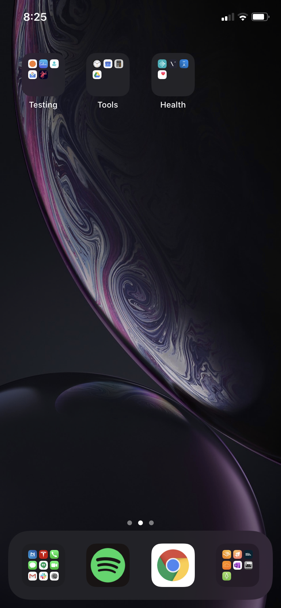
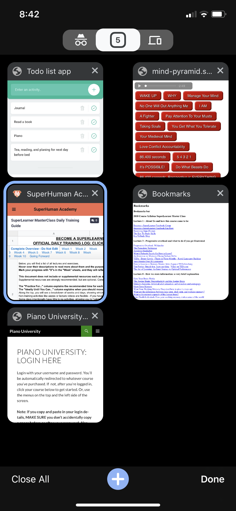
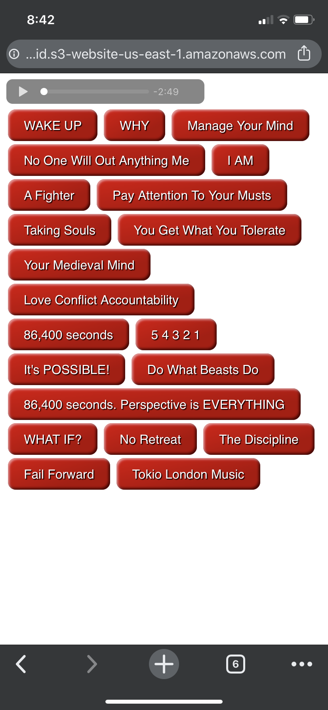

# About my ritual calendar
This calendar is what serves as a baseline of my MUSTS. It is bare minimum I need to do to move forward on everything I'm working on to better myself. Some days I will have more time to put into specific areas and other days I have to improvise. Below I'll give an overview of each with some useful links to resources.

<iframe src="https://calendar.google.com/calendar/embed?src=4ip6sbncqva60ltne18u2s3rr8%40group.calendar.google.com&ctz=America%2FNew_York" style="border: 0" width="800" height="600" frameborder="0" scrolling="no"></iframe>

# Morning Routine
This is constantly changing (family, work, life, ect.) but do my best to get a baseline done and scale time spent here based on how I'm feeling and life obstacles. I pull out all the stops here and do what it takes to get it done.
How I start the day is the most difficult but most important time of the day for me. It is usually a great predictor of how my day is going to be. How I respond to all external factors, overall mood, ect. It starts at 5:30am because my family is up anywhere between 6-7am...and when they are up...the game of life is on!

## 1. Water
I wake up and count down. 5  4  3  2  1. I make the decision to get up before I hit one. I immediately take down 4 cups of cold water that I have setup the night before so I don't have a chance to think about how tired I am, what I have on the todo list for that day, or how good it would feel to get an extra hour in.
- 5. 4. 3. 2. 1. "INSERT REASON WHY YOU HAVE TO GET UP" As Mel Robbins so wonderfully put it in her book <a class="css-is-deranged" href="https://www.amazon.com/Second-Rule-Transform-Confidence-Everyday/dp/B06W9M3QDJ/ref=sr_1_2?crid=9FTZXOOOW50P&dchild=1&keywords=mel+robbins+5+second+rule+book&qid=1586026368&sprefix=mel+robbins%2Caps%2C175&sr=8-2">The Five Second Rule</a>. I HIGHLY recommend this book as this method works in every aspect of life and can be applied universally to radically change it!

## 2. Setting the tone
This has been another big impact area for me. I had to get a bit creative since I needed my phone to access certain tools. All phone notifications are muted 10pm to 8am and my screen layout is structured in a way where I only see what I need. No distractions. Current layout below.

It's actually greyscale as well. <a class="css-is-deranged" href="https://humanetech.com/resources/take-control/">Center for Humane Technology</a> are a great starting resource for getting a setup like this along with other tech hacks that will signfigcantly increase your quality of life.
So first stop here is what has currently mutated to a webapp I built for myself to easily access snippets of one-button inspirational clips that speak to me in profound ways. This will obviously be different for everyone, but there are tons of apps that will do the trick based on your needs.
 
During this time I'm brushing my teeth and proceed to do myofascial release work in my living room. This is another animal and reason that is specific to me and preventative maintenance I do to keep my body feeling good for weightlifting. Additional details can be seen on my body health page <a class="css-is-deranged" href="../mind-body/index.html">here</a>.

## 3. Meditation
I than get into meditating which has been tremendous in so many ways. I am still in the learning phases and trying out many different forms. My main styles currently come from guided meditations on Audible.com. You can look up "Morning Meditations for Daily Magic" if you have an audible subscription. There are also other great resources such as headspace to start than branch on your own from.

## 4. Journal
I journal everyday at some point. Even if its just one sentence. There is a TON of known benefits. I'll leave a few useful resources I've built from as starting points
<a class="css-is-deranged" href="https://dariusforoux.com/how-to-journal/">Read This If You Want To Keep A Journal But Don’t Know How - Darius Foroux</a>

## 5. Workout
Workout time! This is a big one and highly customized in my case in the interest of maximizing time and highly dependent on what quadrant of my life I'm working on. You can find an abundance of information on this in <a class="css-is-deranged" href="https://jamesclear.com/">Atomic Habits by James Clear</a>. Another excellent resource where many of my methods come from.
There are an infinite amount of resources here as well and I will defer to <a class="css-is-deranged" href="../mind-body/index.html">my body health page</a> if you need more information.

## 6. Write down ONE thing I must complete for the day
As soon as I get out of the shower I will write down at least ONE thing either on a post-it note or dry erase board (in a place I know I will see if multiple times.) that I must complete.

## 7. Affirmation & Gratitude
"I'm fragile. I feel pain. I hurt. I open my eyes. I create. I conquer. I hold the power. I'm a thinker. I create victory. I do not give up. I feel no fear. I fear no man. I'm an athlete, a warrior. An artist." - Mickey rourke - Generation Iron
Looking at yourself everday and telling yourself who you are and who you want to be is a powerful way of rewirng your brain and aligning with values you beleive in. This is a work in progress for me.

I also have a few reminders before I start the day to help with specifics I may be struggling with. "Focus on today! Say no or think twice! Appreciate the small moments"
Below is a list of great resources that have helped me with understanding why these concepts are extremely important.
<a class="css-is-deranged" href="https://jamesclear.com/saying-no">Saying NO - James Clear</a>
<a class="css-is-deranged" href="https://medium.com/darius-foroux/the-power-of-single-tasking-b8a08e8b1084">The Power Of Single-Tasking - Darius Foroux</a>
<a class="css-is-deranged" href="https://www.youtube.com/watch?v=Y33fjaeO2Kk">Disconnect & Protect Your Peace - Trent Shelton</a>

# During the day
That "not having enough time feeling" is something everyone struggles with. Whether it's work, family, health, ect. There are many ways I've found to alleviate this feeling. I have listed a few of the methods I've put in to practice daily to overcome this challenge.
Superlearning! This is a world that has been absolutely mind blowing and life changing. It has helped me do infinitely more with significgcantly less time! I have a page dedicated to the impact and details of the process <a class="css-is-deranged" href="../superlearning/index.html">HERE</a>.
<a class="css-is-deranged" href="https://jamesclear.com/feynman-mental-models">Understanding Mental Models</a>
<a class="css-is-deranged" href="https://lifehacker.com/the-power-of-mental-models-how-flight-32-avoided-disas-1765022753">Scenerio of Mental Model</a>
Timing Impacts - <a class="css-is-deranged" href="https://en.wikipedia.org/wiki/Serial-position_effect">Serial-position effect</a> - <a class="css-is-deranged" href="https://en.wikipedia.org/wiki/Distributed_practice">Distributed practice</a> - <a class="css-is-deranged" href="https://en.wikipedia.org/wiki/Spacing_effect">Spacing effect</a> - <a class="css-is-deranged" href="https://en.wikipedia.org/wiki/Spaced_repetition">Spaced repetition</a> - <a class="css-is-deranged" href="https://en.wikipedia.org/wiki/Varied_practice">Varied practice</a>
<a class="css-is-deranged" href="https://moneyminiblog.com/productivity/little-minutes/">Little Minutes</a> - This was the mother load for me. Once I had an understanding of timing effects and applied them accordingly to my schedule/life...EVERYTHING CHANGED! Try it yourself and reap the benefits.
<a class="css-is-deranged" href="https://www.youtube.com/watch?v=_f-qkGJBPts">See. Do. Teach. Repeat. (Feyman Technique)</a> - This is something I'm currently focusing and building on.
Learn to ask questions often!!! Here are a few resources to get you started on how to do this - <a class="css-is-deranged" href="https://en.wikipedia.org/wiki/Five_whys">Five whys</a> - <a class="css-is-deranged" href="https://en.wikipedia.org/wiki/Socratic_method">Socratic method</a> - <a class="css-is-deranged" href="https://en.wikipedia.org/wiki/Elaborative_interrogation">Elaborative interrogation</a> - <a class="css-is-deranged" href="http://www.mempowered.com/study/elaborating">Elaborating for remembering</a>. Another work in progress and an area I feel I can make signfigcant improvements in.

# Bedtime Routine
I have a reminder to begin my routine at 9:30 that says:

> "Make your game plan for tomorrow!"
> "Are you only thinking about how to solve problems and understanding how to leverage knowledge in the different parts of your life?"
> "Clean up your finances."
> "Clean up how you use your time."
> "Clean up your relationships."
> "Cultivate."
> "Just a little bit every day."

I keep it simple.
- Take a few minutes to plan what I would like to accomplish the next day.
- Setup all workout clothes, work clothes, 4 cups of water, ect.
- Make a cup if tea
- Read or listen to a audio book (I've been restricting this to fiction as the mind has been through a ton in the day already. Little trick I learned from [Tim Ferris's book "The Four Hour Work Week"](https://www.amazon.com/4-Hour-Workweek-Expanded-Updated-Cutting-Edge-ebook/dp/B002WE46UW/ref=sr_1_1?crid=1DH0W9Z9P4ZKB&dchild=1&keywords=four+hour+work+week&qid=1588388070&sprefix=four+hour%2Caps%2C451&sr=8-1)

# Planning
There are 5 core planning principles I currently following have scheduled and serve as checkpoints to ensure I'm making progress.

1. A weekly reflection and planning session on Sundays.

2. At the end of each day, I make a game plan for the next day.

3. Focus on the day I'm in once it's started.

4. Revise the following every three months:
  - Vision (my why) = 10–25 years’ out
  - Long-term goals (wild guess) = 36 months’ out
  - Actual goals (realistic game plan) = the next 90 days

5. Organize everything in my life one day at a time.
  - By cleaning up finances.
  - By cleaning up how I use my time.
  - By cleaning up my relationships.
  - Cultivating all those around me.
  - Just a little bit every day.
  - I have a reminder to reflect on this before bed daily.

**[Bonus - My Master Evernote list for planning](https://www.evernote.com/l/ALdSAVdozHVN3JFHuUNBirfeMWivBz9iA6A)**

# Tech
1. Evernote - I recently did the <a class="css-is-deranged" href="http://killthechaos.net/">ZERO TO 60 WITH EVERNOTE</a> "Kill The Chaos of information overload" by Charles Burd. The tagging system used to easily get access to any information had me migrating from OneNote the next day!
2. <a class="css-is-deranged" href="https://getpocket.com/">Pocket</a> to save articles I want to read later in a speed reading friendly way! This is where the little minutes shine.
3. Google Calendar - Ok, so this may seem straight forward. However, once you implement a system that works for you, it can really accelerate the use of your valuable time. This course on Skillshare <a class="css-is-deranged" href="https://www.skillshare.com/classes/HOW-TO-tackle-your-daily-tasks-using-GOOGLE-CALENDAR-and-iNotes/624785691/projects?via=search-layout-grid">HOW TO tackle your daily tasks using Google Calendar by Dash Barksdale</a> teaches you how to use a color coding system to plan your week
4. Tech Stack - As a "DevOps Engineer", I like to stick to these set of tools I use daily to get work done both professionally and in personal projects.
OS - MAC with virtualbox or amazon linux or Ubuntu on AWS/GCP
Editor and Terminal - Atom and plain mac terminal with some custom python cli wrappers for repeatable tasks.
Python, Bash, Docker, Ansible, Jenkins, Kubernetes,
5. <a class="css-is-deranged" href="https://folivora.ai/">Better Touch Tool</a> - I use this to make custom gestures to limit mouse usage.
6. <a class="css-is-deranged" href="https://support.apple.com/guide/automator/welcome/mac">Automator</a> - I use this to make custom shortcut keys for shell scripts.

# Others
1. <a class="css-is-deranged" href="https://en.wikipedia.org/wiki/Pomodoro_Technique ">Pomodoro Technique</a> - Amazing productivity gainzzz!
2. Stand up desk! <a class="css-is-deranged" href="https://www.lifehack.org/articles/lifestyle/why-sitting-is-killing-you.html">Why should you should stand?</a> Don't know where to start? <a class="css-is-deranged" href="https://blog.jle.vi/post/66278853881/improving-on-the-22-ikea-standing-desk">Try this</a>
