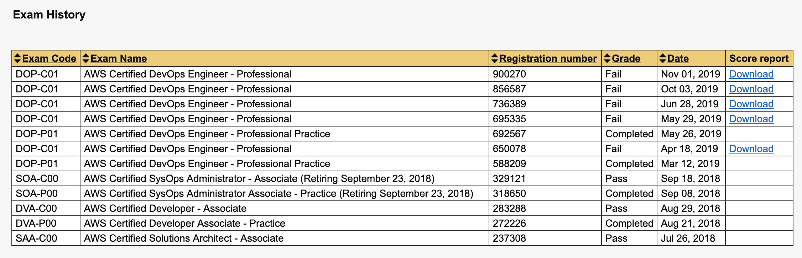
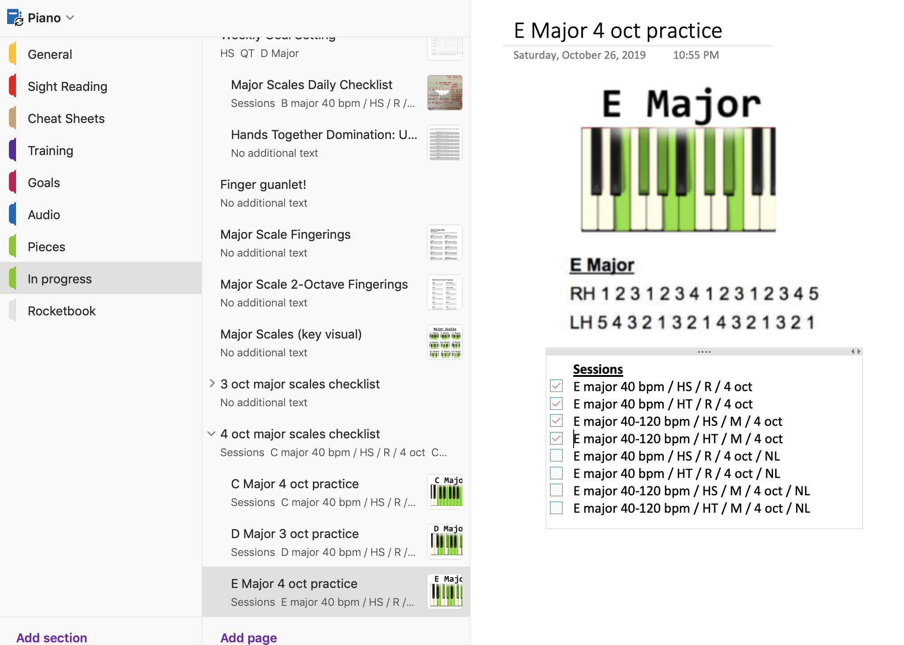

# Introduction
 It all started in May of 2018 when a good friend and co-worker asked me if I wanted to do something new career/technology wise. Luis Suarez is his name. He told me I should look into AWS certifications. Shortly after deep diving into a few online courses, I became obsessed and saw an opportunity to take my career to the next level with something I was excited about.
 I always told myself and others that I was not a good test taker so I was determinded to prove myself wrong. For the next few months, I would do the typical bing studying for the exams taking every angle possible.
 This would eventually lead me to obtaining 3 AWS associate level certifications in less than 5 months. I followed this with an update of my resume and took my first step into a new career path. As I gained experience in my role, I was encourged to take the fast track by obtaining a professional level certification which required mininum experience of 2 years on top of an incredible amount of technical information I had to memorize.
 I went on to attempt the exam for professional certification over the next 7 months and failing 5 times. I didn't fully understand my problem or at least did not see it as a main contributor to holding me back. I quickly became a top quality engineer that others came to for help and was respected.
 The common denominator was always running out of time and the ability to read and comprehend the question in a timely manner.

# My journey to becoming a superlearner!

       

<section class="questions-section">
# The start of my journey to becoming a piano superhuman

## Below is a snippet of how I currently organize my piano notes.
     
